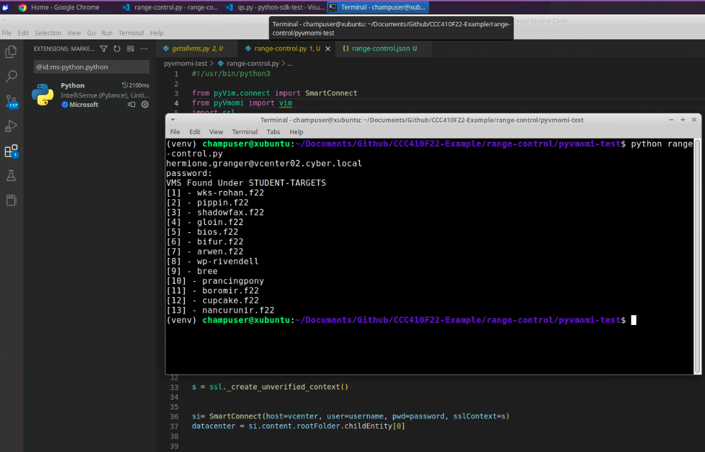
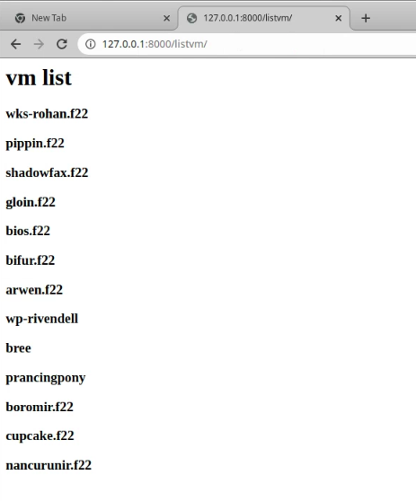

# Design Project 2 - Ethhack UI

> I've chosen to stick with the Ethhack UI Topic, I've built up some forward momentum.  This topic will focus on the selection of the appropriate VMWare API and its integration into Django

## Project Information

* [Project Milestone](https://github.com/gmcyber/CCC410F22-Example/milestone/2)
* [Project Kanban](https://github.com/users/gmcyber/projects/2)

## Tasks

### Week 1 - User Access to Django

> Currently, only members of the ethhack-ui admin's group can access the Django admin screens.  We need to create a Django App that allows non admin users to access non administrative functions in django. 

* Build a user login screen, display session and LDAP infromation for the logged in user

  > This was successful, heres a screenshot after login that shows all the AD groups that the test user is a member of:

   

* [Design Project 2 - Demo 1](https://drive.google.com/file/d/1b9hgyJNf0Cq8P8BxOdOBEIAcocEneCoV/view?usp=sharing)

* [Code](https://github.com/gmcyber/CCC410F22-Example/tree/main/ethhack-ui/rc_django)

### Weeks 2 and  3 - Test the Python Access to VSphere

* Command line only, given username, list VMs from the ETHHACK course that use has access to.

  > Once I was able to stumble upon the correct parameters for SSLContext, listing the VMs a given user has access to was rather trivial.  Here is a sample run

   

* [Design Project 2 - Demo 2](https://drive.google.com/file/d/12ENStc9MRd_JgIPmCohBefLu9I0uLjAN/view?usp=sharing)

* [Code](https://github.com/gmcyber/CCC410F22-Example/tree/main/ethhack-ui/pyvmomi-test)

### Week 4 - Integrate Python/vSphere and Django 

* References:
  * https://www.appsloveworld.com/django/100/307/pyvmomi-get-folders-name

* More design here needed
  * We need a vsphere service user (it could be the same one as LDAP) who can see all the targets and see who has access to them.  Place username/pw in secure_settings.py
  * We need a new role in vpshere for the service user.  It is possible they have the same permissions as the EthHack Role
  * named user logs in to the Ethhack UI
  * the vsphere service users checks to see what VMs that user has access to
  * those vms are printed out

* Integrate the login screen from week 1 as well as the python SDK code written in weeks 2 and 3 such that a user can login to the django ethhack-ui user login area and see information on the targets that they have access to.

* Some Success at the 11th hour, this involved executing pyvmomi from view.py/listvm, passing the vms collection to vms.html for iteration and display

   

> There is some work to do here.  In terms of performance, the application should have 1 connection to vcenter as opposed to a connection for every user that connects to the application.  The access control can be simplified to say.  If logged in django-user is in the ETHHACK group, they are entitled to see all VMs and interact with them in the same way that they could on vcenter.  We will just be using the proxy user "range.control" to facilitate this.  The vcenter smartconnection needs to essentially be a global variable, though the list of VMs and their state would be refreshed per django user.

* [Design Topic 2 Demo 3](https://drive.google.com/file/d/1WJIflQfgyLeer_rIvtD7fa57qO05ONrF/view?usp=sharing)
