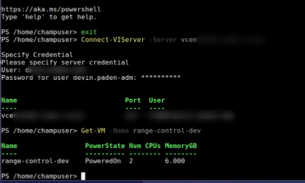
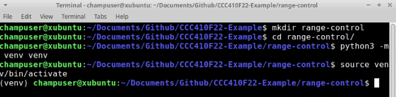
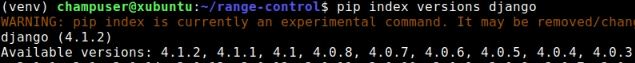
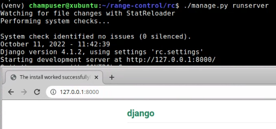
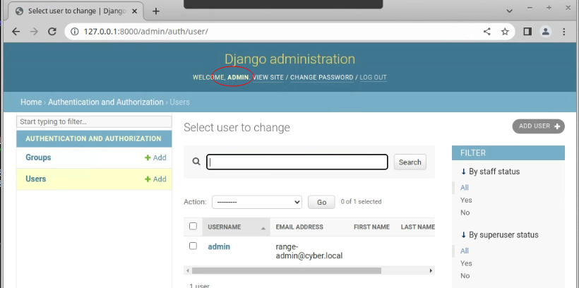

# ethhack-ui-dev.cyber.local

> This xubuntu system will be used to develop the Ethhack UI web service.  The production deploy will target an ubuntu foca server.

[TOC]

## Configuration

* full clone of base vm xubuntu.f22 (xubuntu foca)
* 2 CPU, 6GiB RAM
* Datacenter DHCP on 192.168.4.0/24
* change default champuser password
* Update Chrome, install CRD

## Tools

### VSCode

```bash
sudo apt install snapd
sudo systemctl enable snapd
sudo systemctl start snapd
sudo snap install code --classic
```

### Powershell

```
sudo snap install powershell --classic
pwsh
Write-Host $PSVersionTable
```

### PowerCLI

```powershell
Install-Module VMware.PowerCLI -Scope CurrentUser
Get-Module VMware.PowerCLI -ListAvailable
Set-PowerCLIConfiguration -InvalidCertificateAction Ignore
Set-PowerCLIConfiguration -Scope User -ParticipateInCEIP $false
```

* Test

  ```powershell
  Connect-VIServer -Server HOSTNAME.DOMAINNAME.GOESHERE
  Get-VM -Name ethhack-ui-dev
  ```

   

### python venv

```bash
sudo apt update
sudo apt install python3-pip python3-venv -y

mkdir ethhack-ui
cd ethhack-ui
python3 -m venv venv
source venv/bin/activate
```

 

### pip installation of pyvmomi

> note, pyvmomi may not be the way to go.  It's source has not been updated.  I will also investigate the [vsphere automation sdk for python](https://github.com/vmware/vsphere-automation-sdk-python)

```bash
pip install pyvmomi wheel
```

### pip installation of vsphere automation sdk for python

```bash
sudo apt install git
pip install --upgrade git+https://github.com/vmware/vsphere-automation-sdk-python.git
```

### pip installation of django

 

```bash
pip install django==4.1.2
django-admin --version
django-admin startproject rc_django
cd rc_django
```


#### configure django

```bash
./manage.py migrate
./manage.py createsuperuser
```

  

> admin user's password is in lastpass

#### first run

```bash
./manage.py runserver
```

 

> Note, repeated this process within the Github source tree so that it could be placed under source code control.  Added a .gitignore file to avoid uploading python binaries associated with the virtual environment.

### Authenticated as local django admin

  
