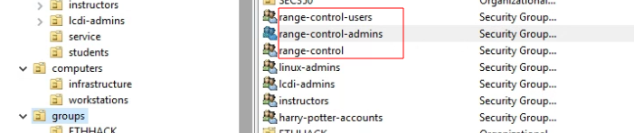
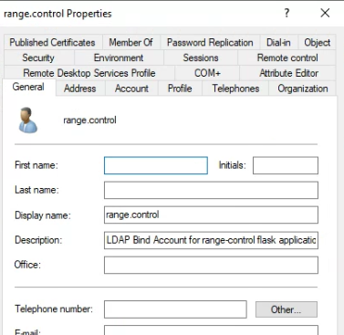

# AD Configuration

> Leveraging cyber.local ADCS environment

## Ethhack UI Security Groups

 

* ethhack-ui users will be students who will have limited access to student specific functionality
* ethhack-ui admins will have staff and superuser access to the Ethhack UI application
* ethhack-ui is a parent group, containing both admins and users. 

## range.control service user

 

