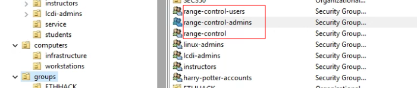

# AD Configuration

> Leveraging cyber.local ADCS environment

## Range Control Security Groups

 

* range-control users will be students who will have limited access to student specific functionality
* range-control admins will have staff and superuser access to the range control application
* range-control is a parent group, containing both admins and users. 

## range.control service user

 

