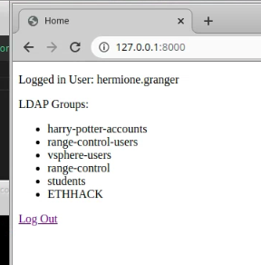

# Design Project 2 - Range Control

> I've chosen to stick with the Range Control Topic, I've built up some forward momentum.  This topic will focus on the selection of the appropriate VMWare API and its integration into Django

## Project Information

* [Project Milestone](https://github.com/gmcyber/CCC410F22-Example/milestone/2)
* [Project Kanban](https://github.com/users/gmcyber/projects/2)
* Code:

## Tasks

### Week 1 - User Access to Django

> Currently, only members of the range-control admin's group can access the Django admin screens.  We need to create a Django App that allows non admin users to access non administrative functions in django. 

* Build a user login screen, display session and LDAP infromation for the logged in user

  > This was successful, heres a screenshot after login that shows all the AD groups that the test user is a member of:

   

* [Design Project 2 - Demo 1](https://drive.google.com/file/d/1b9hgyJNf0Cq8P8BxOdOBEIAcocEneCoV/view?usp=sharing)

### Weeks 2 and  3 - Test the Python Access to VSphere

* Command line only, given username, list VMs from the ETHHACK course that use has access to.

  > Once I was able to stumble upon the correct parameters for SSLContext, listing the VMs a given user has access to was rather trivial.  Here is a sample run

   

* [Design Project 2 - Demo 2](https://drive.google.com/file/d/12ENStc9MRd_JgIPmCohBefLu9I0uLjAN/view?usp=sharing)

### Week 4 - Integrate Python/vSphere and Django 

* Integrate the login screen from week 1 as well as the python SDK code written in weeks 2 and 3 such that a user can login to the django range-control user login area and see information on the targets that they have access to.

