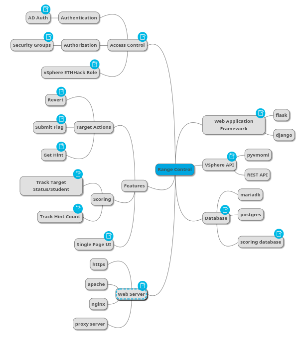

# Ethhack UI Topic Decomposition

The following mindmap and outline represent an initial decomposition of the Ethhack UI topic

## Mindmap

## Outline

# Ethhack UI

## Web Application Framework

The major contender is Django which out of the box supports authentication and armed with and LDAP library could support AD authentication.  It comes with a database ORM.  Flask is far lighter weight and would require far more code but it also gives a great deal of flexibility.

### flask

### django

## VSphere API

vsphere has a couple methods to interract with the backend.   PowerCLI would be preferred but is not supported by any web application framework.  pyvmomi is a popular library that exposed vcenter actions through Python.  Alternatively the REST API can be used but this appears to be overly complex.

### pyvmomi

### REST API

## Database

We need a database, the intent is to run this under linux so mariadb or postgresql are the likely contenders.

### mariadb

### postgres

### scoring database

We need a means to persist user data across sessions with Ethhack UI

## Access Control

use the same backend authentication process in conjunction with AD security groups and vsphere roles to provide seamless authentication and authorization to the web application and backend components

### Authentication

* AD Auth

	We currently use Microsoft Active Directory to authenticate students to cyber.local and this is also integrated as an SSO provider for vsphere login.  The web application framework needs to support LDAPs so that the same authentication is supported.

### Authorization

* Security Groups

	Ethical Hacking Students should be assigned to a secruity group.  The security group in conjunction with a limited vsphere role will limit what students can do with the target virtual machines.

### vSphere ETHHack Role

The ethical hacking student should be able to revert a virtual machine and power it on again.  There may be some limitations for reverting the system.

## Features

### Target Actions

* Revert

	Revert the target to a "Target Ready" vmware snapshot and power that VM back on.
* Submit Flag

	Targets typically have a user and a root/administrator flag.   Acquisition of these flags indicate a "proof" that the student achieved a level of access on the target.
* Get Hint

	For difficult targets, hints can be created that give students a direction to pursue.  Use of a hint should come at a cost in terms of overall points for a given target.

### Scoring

* Track Target Status/Student

	Student Progress through the range target should be tracked and displayed for the logged in user.
* Track Hint Count

	Hints should come at a cost.  If a target is worth n points, use of a hint should take off 10% of the achieved base score.

### Single Page UI

Keep it sample a tabular display of target VMs with action links should do it.

## Web Server

the selection of web server should go hand in hand with the selection of web application framework.  Apache and nginx should work.  The web server will likely need to be configured with a proxy so that ssl connections are redirected to the local listener used by the web application framework.

### https

### apache

### nginx

### proxy server